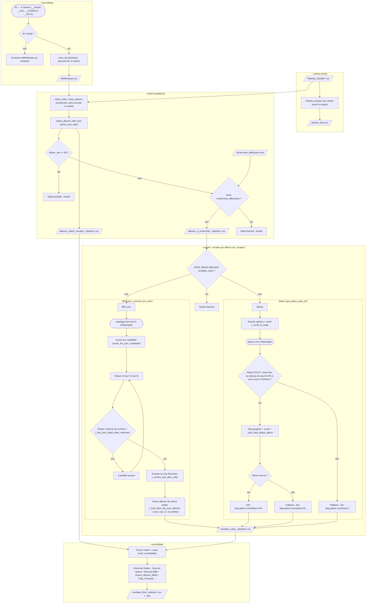

# Service : A_Recuperer

Pipeline de bout en bout pour identifier les albums présents dans les playlists Spotify mais absents de la bibliothèque physique, puis les localiser à la Bibliothèque Municipale de Lyon (Part-Dieu) et/ou sur Qobuz.

---

## Objectif

Répondre à la question : **quels albums de mes playlists est-ce que je n'ai pas encore, et où les trouver ?**

Le service croise trois sources :
1. **Playlists Spotify** — ce que tu écoutes
2. **Bibliothèque physique** (`M:\musiques\__Autres`) — ce que tu possèdes
3. **Recherches déjà effectuées** — ce qui a déjà été cherché (évite les doublons)

Pour les albums manquants, il scrape automatiquement :
- La **BM Lyon Part-Dieu** : disponibilité et cote de rangement
- **Qobuz** : URL directe de lecture/achat

---

## Schéma fonctionnel



### Détail des actions

1. **`--extract-artists`** — `cmd_extract_artists()` (main.py) charge toutes les playlists (`load_playlists`), prend la 1ère valeur de `Artist` avant la virgule (artiste principal des collabs), dédoublonne et écrit `data/Ressources/artistes_liste.csv` (liste partagée avec les autres services).
2. **`--scan-library`** — `cmd_scan_library()` → `scan_all_libraries()` (utils/library.py) parcourt les 4 racines physiques (`LIBRARY_PATH` etc.) et produit `bibliotheque.csv` (`Artist`, `Album`, `Path`). **Garde-fou** : si la racine principale `__Autres` est introuvable (M: non monté), on **n'écrase pas** la `bibliotheque.csv` existante (évite de perdre le snapshot depuis une machine sans accès M:).
3. **`--match`** — `cmd_match()` nettoie les noms (`clean_artist`/`clean_albums` : `unidecode`, sans accents/casse/parenthèses) puis `match_albums_with_fuzz` (utils/matching.py, `rapidfuzz.token_sort_ratio`) compare chaque (artiste, album) de playlist à la bibliothèque. Un album est **à récupérer** si `Album_sim < 80` (`ALBUM_THRESHOLD`) **et** absent de `recherches_effectuees.xlsx`. Sorties : `albums_a_rechercher_<playlist>.csv` (à scraper) et `albums_match_complet_<playlist>.csv` (avec scores + `Path_Possede` pour la consolidation).
4. **`--search` (boucle)** — `run_scraper()` (utils/scraper.py) lit `albums_a_rechercher_<playlist>.csv`, **saute** les couples (Artist, Album) déjà présents dans `resultats_cotes_<playlist>.csv` (reprise après interruption), et pour chaque album restant interroge **BM Lyon puis Qobuz** (les deux toujours, côte à côte). Append + flush ligne par ligne ; toute sélection est journalisée dans `debug_selection.csv`.
5. **BM Lyon** — `_process_bm_lyon()` recherche `"{artiste} {album} Disque compact"`, score les notices ISBD (`score_bm_lyon_candidate`, pondère titre+auteur), clique les `BM_TOP_K_CANDIDATES` (5) meilleures, et **re-vérifie l'artiste sur la fiche détail** via `_bm_lyon_detail_artist_matches()` (Auteur fiche → auteur parsé → h1, tolérance sous-ensemble). Si confirmé et présence Part-Dieu : `_extract_part_dieu_cote()` lit la/les cote(s) + dispo (`Status = Found`). Dans tous les cas où l'artiste existe à la BM Lyon, `_find_other_bm_lyon_albums()` liste ses **autres** albums (scroll lazy-load, jusqu'à `max_extra = 12`, chaque album re-vérifié) → colonne `Autres_albums_biblio`.
6. **Qobuz** — `get_qobuz_play_url()` cherche d'abord la page artiste (`get_qobuz_link_via_artist`) : récolte des candidats `/interpreter/` après `_scroll_to_load` (lazy-load), **préférence au match normalisé exact** (départage *Christophe* de *Christopher*) sinon meilleur flou ≥ seuil (`_artist_match_threshold` : 0.95 pour les noms ≤ 6 lettres, 0.85 sinon). Sur la page artiste, parcourt la discographie (scroll, jusqu'à 150 items) et choisit l'album (`_pick_best_qobuz_album`). Fallbacks en cascade : lien artiste `play.qobuz.com/artist/<id>` si l'album précis est introuvable, recherche directe puis lien `play.qobuz.com/search/` en dernier recours. Toutes les URLs rendues pointent sur `play.qobuz.com` (jamais `www.qobuz.com`, réservé à la navigation interne du scraper).
7. **`--consolidate`** — `cmd_consolidate()` fusionne `albums_match_complet_<playlist>.csv` (matching biblio locale) et `resultats_cotes_<playlist>.csv` (cotes BM Lyon + Qobuz), recompose les colonnes lisibles (`Sources Qobuz`, `Sources Bibli` = cote + dispo, `Autres_albums_biblio`, `Path_Possede` relatif) et écrit `data/Resultats/resultats_final_<playlist>.csv` + `.xlsx` (fichier de consultation final).

---

## Architecture des fichiers

```
sources/A_Recuperer/
├── main.py               # CLI : point d'entrée principal
├── A_Recuperer.ipynb     # Notebook interactif (même logique)
├── requirements.txt
└── utils/
    ├── matching.py       # Fuzzy matching playlist↔bibliothèque (rapidfuzz)
    ├── text_match.py     # Matching strict scraper : SequenceMatcher + parsing ISBD
    ├── library.py        # Scan de la bibliothèque physique
    ├── data_loader.py    # Chargement playlists + recherches_effectuees
    └── scraper.py        # Scraper BM Lyon + Qobuz (Playwright)
```

---

## Flux d'exécution

### Étape 1 — Scan de la bibliothèque (`--scan-library`)

`scan_all_libraries()` parcourt **4 racines** avec des conventions de nommage
différentes (cf. `utils/library.py`) :

- `M:\musiques\__Autres`  — `Artiste/Album/` (cas standard, **seule racine utilisée pour le matching réel**)
- `M:\musiques\__B.O`     — `"Album - Artiste"/` (split au dernier `-`)
- `M:\musiques\__COMPILS` — `Album/` → Artist forcé à `"Various Artists"`
- `M:\musiques\__JEUX`    — `Album/` → Artist forcé à `"BO Jeux"`

Le résultat fusionné est dédoublonné et sauvegardé dans
`data/Bibliotheque/bibliotheque.csv` (+ `bibliotheque.xlsx`).

**M: optionnel** : si le lecteur n'est pas accessible (ex: pipeline lancé
depuis une machine sans le partage réseau monté), `--scan-library` ne
fait rien — le `bibliotheque.csv` existant est conservé tel quel. Permet
de relancer `--match`/`--search`/`--consolidate` sur un snapshot
précédent sans perdre la biblio.

À relancer uniquement quand la bibliothèque physique a changé.

---

### Étape 2 — Chargement des trois sources et matching (`--match`)

`cmd_match()` charge **trois sources** en parallèle avant de faire le matching :

**Source 1 — Playlists** (`load_playlists`)

`load_playlists()` parcourt tous les CSV de `data/Playlists_Spotify/` sans distinction. Deux types coexistent :

| Type | Exemples | Contenu |
|---|---|---|
| Annuelles | `Titres_2017.csv` … `Titres_2025.csv` | Mes 50 titres de l'année, immuables |
| Thématiques | `La_French.csv`, `Zen.csv`, `Partage.csv` | Mises à jour manuellement |

Chaque fichier reçoit une colonne `Playlist` = nom sans extension, puis tous sont concaténés en un seul DataFrame.

**Source 2 — Bibliothèque physique**

`pd.read_csv(data/Bibliotheque/bibliotheque.csv)` — le CSV généré par `--scan-library`. Contient tous les albums physiquement possédés.

**Source 3 — Recherches déjà effectuées** (`load_recherches_effectuees`)

`load_recherches_effectuees(data/Ressources/recherches_effectuees.xlsx)` — fichier tenu à jour manuellement. Liste les albums déjà scrappés lors des runs précédents pour ne pas les relancer.

---

**Normalisation et matching**

```
Source 1 : df_playlists
  │  dédoublonnage sur (Artist, Album)
  │  clean_artist() + clean_albums()
  │    → minuscules, sans accents, sans parenthèses
  │    → suppression de "Deluxe", "Radio Edit", "EP"
  │    → split sur la virgule (prend le premier artiste)
  │
Source 2 : df_biblio = bibliotheque.csv (les 4 racines scannées)
  │  même normalisation appliquée
  │
  ▼
match_albums_with_fuzz()   (rapidfuzz · token_sort_ratio)
    fuzzy scoring SUR les colonnes Artist_clean/Album_clean
    (préserve les noms bruts en sortie pour le scraper et l'affichage)
    seuil artiste : 90
    seuil album   : 80
  │
  ├── Album_sim ≥ 80         → déjà possédé en bibliothèque, ignoré
  │
  ├── dans df_recherches     → déjà scrappé (Source 3), ignoré
  │   (jointure normalisée via clean_artist/clean_albums des 2 côtés —
  │    le xlsx étant tenu à la main avec des noms déjà cleaned)
  │
  └── reste → data/Ressources/albums_a_rechercher.csv
```

**Mesure typique sur la playlist Partage** (mai 2026, biblio ~11k albums) :

| Étape | Albums restants |
|---|---|
| Albums Partage uniques | 3 136 |
| Après matching biblio fuzzy (Album_sim ≥ 80 ⇒ exclus) | quelques centaines |
| Après filtre `recherches_effectuees.xlsx` | **~40** |

---

### Étape 3 — Scraping (`--search`)

```
albums_a_rechercher.csv
        │
        ▼ run_scraper()  (Playwright · Chromium headless · locale fr-FR)
        │
        ├── catalogue.bm-lyon.fr
        │     recherche : "{Artist} {Album} Disque compact"
        │     vérifie l'artiste sur la page de détail
        │     cherche "Part-Dieu" → extrait Cote + Disponibilité
        │
        └── qobuz.com
              stratégie 1 : artiste → page artiste → parcours discographie (≤ 50 titres)
              stratégie 2 (fallback) : recherche directe "{Artist} {Album}"
              → URL play.qobuz.com/album/...
                          │
                          ▼
              data/Ressources/resultats_cotes.csv
              (reprise automatique si le fichier existe déjà)
```

---

## Commandes CLI

```bash
cd sources/A_Recuperer

# Pipeline complet (recommandé)
uv run python main.py --all

# Étapes séparées
uv run python main.py --scan-library  # Génère data/Bibliotheque/bibliotheque.csv
uv run python main.py --match         # Génère albums_a_rechercher.csv + albums_match_complet.csv
uv run python main.py --search        # Génère data/Ressources/resultats_cotes.csv
uv run python main.py --consolidate   # Génère data/Resultats/resultats_final.csv
```

**Quand utiliser chaque étape séparément :**
- `--scan-library` : uniquement quand la bibliothèque physique a changé (nouveaux albums ajoutés)
- `--match` : après ajout de nouvelles playlists ou mise à jour de `recherches_effectuees.xlsx`
- `--search` : pour scraper les albums déjà identifiés sans relancer tout le matching
- `--consolidate` : pour regénérer le fichier final sans relancer le scraping

### Restreindre à une seule playlist (`PLAYLIST_FILTER`)

Par défaut, `--match` charge **toutes** les playlists de `data/Playlists_Spotify/`
et les concatène. Pour ne traiter qu'**une seule** playlist (ex: chercher
uniquement ce qu'il manque dans `Partage`), définir la variable d'environnement
`PLAYLIST_FILTER` avec le nom du fichier (sans extension) :

```bash
# Tout le pipeline restreint à la playlist Partage
PLAYLIST_FILTER=Partage uv run python main.py --match
PLAYLIST_FILTER=Partage uv run python main.py --search
PLAYLIST_FILTER=Partage uv run python main.py --consolidate

# Run global par défaut (toutes les playlists)
uv run python main.py --match
```

Les fichiers générés sont alors **suffixés** avec le nom de la playlist
pour ne pas écraser le run global :

| Fichier global | Avec `PLAYLIST_FILTER=Partage` |
|---|---|
| `data/Pipeline/albums_a_rechercher.csv`  | `albums_a_rechercher_Partage.csv` |
| `data/Pipeline/albums_match_complet.csv` | `albums_match_complet_Partage.csv` |
| `data/Pipeline/resultats_cotes.csv`      | `resultats_cotes_Partage.csv` |
| `data/Resultats/resultats_final.csv`     | `resultats_final_Partage.csv` |

Si le nom passé n'existe pas dans le dossier des playlists, le script
affiche la liste des playlists disponibles et s'arrête sans rien écrire.
La variable doit être définie pour **chaque** invocation de la pipeline
(`--match`, `--search`, `--consolidate`) — sinon les paths ne correspondent
plus.

`uv run` utilise automatiquement le venv `.venv/` présent dans le répertoire courant. Pas besoin d'activer manuellement.

---

### Consulter sa bibliothèque physique

**Rafraîchir le scan** (à relancer quand tu ajoutes des albums dans `M:\musiques\__Autres`) :

```bash
cd sources/A_Recuperer
uv run python main.py --scan-library
# → data/Bibliotheque/bibliotheque.csv  (~3240 artistes)
```

**Rechercher un artiste ou un album dans le CSV généré :**

```bash
# Tous les albums d'un artiste
grep -i "air" ../../data/Bibliotheque/bibliotheque.csv

# Compter le nombre d'albums
wc -l ../../data/Bibliotheque/bibliotheque.csv
```

**Ou depuis Python / notebook :**

```python
import pandas as pd
df = pd.read_csv("../../data/Bibliotheque/bibliotheque.csv")

# Chercher un artiste
df[df["Artist"].str.contains("Air", case=False)]

# Nombre d'albums par artiste (top 10)
df.groupby("Artist").size().sort_values(ascending=False).head(10)
```

---

## Modules `utils/`

Ces fonctions sont conçues pour être importées dans les notebooks autant que dans le CLI.

### `utils/matching.py`

| Fonction | Signature | Description |
|---|---|---|
| `clean_artist(text)` | `str → str` | Normalise un nom d'artiste : supprime parenthèses, accents, met en minuscules |
| `clean_albums(text)` | `str → str` | Normalise un nom d'album : supprime crochets, "Deluxe", "Radio Edit", "EP", accents |
| `match_albums_with_fuzz(df_a, df_b, name_a, name_b, threshold)` | `DataFrame, DataFrame, str, str, int → DataFrame` | Fuzzy matching artiste+album entre deux DataFrames |
| `get_percentage(count, total)` | `int, int → int` | Calcul de pourcentage tronqué |

**Détail du matching :**

1. Pour chaque ligne de `df_a`, cherche le meilleur artiste dans `df_b` avec `fuzz.token_sort_ratio`
2. Si `Artist_sim ≥ threshold` (défaut 90), filtre les albums de cet artiste et cherche le meilleur album
3. Retourne un DataFrame avec les scores de similarité pour artiste et album

**Exemple d'utilisation dans un notebook :**

```python
from utils.matching import clean_artist, clean_albums, match_albums_with_fuzz

df_playlists['Artist_clean'] = df_playlists['Artist'].apply(clean_artist)
df_biblio['Artist_clean'] = df_biblio['Artist'].apply(clean_artist)

df_match = match_albums_with_fuzz(
    df_playlists, df_biblio,
    name_tester='Playlist', name_ressource='Biblio',
    artist_similarity_threshold=90
)
# Filtrer les non-trouvés
df_a_recuperer = df_match[df_match['Album_sim'] < 80]
```

---

### `utils/library.py`

| Fonction | Signature | Description |
|---|---|---|
| `scan_library(path, output_path)` | `str, str|None → DataFrame` | Parcourt `path/Artiste/Album/` (compat historique, racine `__Autres` uniquement) |
| `scan_all_libraries(autres, bo, compils, jeux, output_path)` | tous optionnels → `DataFrame` | Scanne les 4 racines avec leurs règles spécifiques et fusionne |
| `scan_artist_album_root(path)` | `str → list[dict]` | Stratégie `Artiste/Album/` |
| `scan_bo_root(path)` | `str → list[dict]` | Stratégie `"Album - Artiste"/` (split au dernier `-`) |
| `scan_album_only_root(path, fixed_artist)` | `str, str → list[dict]` | Stratégie `Album/` avec artiste forcé |

La bibliothèque est répartie sur 4 racines avec des conventions distinctes :

| Racine Windows | Convention dossier | Mapping `(Artist, Album)` |
|---|---|---|
| `M:\musiques\__Autres`  | `Artiste/Album/`        | tel quel |
| `M:\musiques\__B.O`     | `"Album - Artiste"/` ou autre | split au **dernier** `-` si présent ; sinon `Artist="BO"`, `Album=nom_dossier` |
| `M:\musiques\__COMPILS` | `Album/`                | Artist = `"Various Artists"` |
| `M:\musiques\__JEUX`    | `Album/`                | Artist = `"BO Jeux"` |

Exemple `__B.O` :
- `1989-2024 - John Williams` → split au dernier `-` → `Album="1989-2024"`, `Artist="John Williams"`
- `Disney Best OF` (pas de `-`) → `Artist="BO"`, `Album="Disney Best OF"` (cohérent avec `__JEUX`)

Accessible depuis WSL via `/mnt/m/musiques/...`.

Les 4 chemins sont configurables via variables d'environnement :
`LIBRARY_PATH` (défaut `__Autres`), `LIBRARY_BO_PATH`, `LIBRARY_COMPILS_PATH`,
`LIBRARY_JEUX_PATH`.

> **Le lecteur M: doit être monté dans WSL avant de lancer `--scan-library`.**
> WSL n'auto-monte pas les lecteurs connectés après son démarrage (lecteurs réseau, externes, etc.).
>
> **Mount manuel (temporaire, à refaire après redémarrage WSL) :**
> ```bash
> sudo mkdir -p /mnt/m
> sudo mount -t drvfs M: /mnt/m
> ```
>
> **Mount permanent (via `/etc/fstab`) :**
> ```bash
> sudo mkdir -p /mnt/m
> echo 'M: /mnt/m drvfs defaults,uid=1000,gid=1000 0 0' | sudo tee -a /etc/fstab
> sudo mount -a
> ```
> Avec `/etc/fstab`, le mount est restauré automatiquement à chaque démarrage de WSL.

**Résultat sauvegardé dans :** `data/Bibliotheque/bibliotheque.csv`

---

### `utils/data_loader.py`

| Fonction | Signature | Description |
|---|---|---|
| `load_playlists(folder_path)` | `str|Path → DataFrame` | Charge tous les CSV d'un dossier en un seul DataFrame, avec colonne `Playlist` |
| `load_recherches_effectuees(path)` | `str|Path → DataFrame` | Charge `recherches_effectuees.xlsx`, dédoublonne sur (Artist, Album) |

---

### `utils/scraper.py`

Scraper basé sur **Playwright** (navigateur headless Chromium, locale `fr-FR`).

| Fonction | Description |
|---|---|
| `run_scraper(input_csv, output_csv)` | Point d'entrée principal : lit le CSV d'albums et écrit les résultats |
| `get_qobuz_play_url(page, artist, album)` | Cherche l'URL Qobuz pour un album |
| `get_qobuz_link_via_artist(page, artist, album)` | Stratégie 1 : artiste → discographie → album |

**Pré-traitement de l'artiste — split virgule** :
Pour les collabs Spotify ("Ghostpoet,Paul Smith", "-M-,Jordan Cauvin,..."),
seul l'**artiste principal** (premier avant `,`) est utilisé pour les
recherches catalogue (sinon aucun match possible). Helper `_primary_artist`.

**Stratégie BM Lyon (toujours exécutée)** :
1. Recherche `{Artiste primaire} {Album} Disque compact` sur `catalogue.bm-lyon.fr`
2. Récolte de **tous les liens** de résultat contenant "Disque compact"
3. **Scoring strict** : parse ISBD `Titre / Auteur. - Disque compact - Année`
   (titre et auteur nettoyés : `[Disque compact]`, `(groupe)`, etc.) →
   `score = 0.55·sim(album, titre) + 0.45·sim(artiste, auteur)`
4. Top-K (5) candidats → clic en ordre, double vérification artiste sur
   page de détail :
   - Lit `Auteur : <nom>` du label (plus fiable que le parsing du libellé)
   - Tolère l'**inversion** prénom/nom ("Cosma Vladimir" ≡ "Vladimir Cosma")
   - Tolère le **sous-ensemble** ("Bourvil" ⊂ "Andre Bourvil") si tokens ≥ 5 chars
5. Si Cote Part-Dieu trouvée → on cherche aussi les **autres albums Disque compact**
   du même artiste (max 8) avec leur cote → colonne `Autres_albums_biblio`
6. Reprenable (état conservé dans `resultats_cotes.csv`)

**Stratégie Qobuz (toujours exécutée en complément)** :
1. Recherche artiste → score **tous** les candidats sur slug + display name
   (cleané de "21 albums", "Suivre", etc.), match strict ≥ 0.85
2. Si artiste matché → page artiste → parcours discographie (≤ 50 titres)
   → meilleur titre album ≥ 0.55
3. **Fallback artist-only** : si artiste matché mais pas l'album précis,
   retourne `https://play.qobuz.com/artist/<id>` (utile pour les
   recherches Qobuz capricieuses, ex: AaRON, Ghostpoet)
4. Fallback recherche directe `{Artiste primaire} {Album}` → scoring
   `div.album-item` (sim_artiste ≥ 0.85)
5. Si aucun match précis ni artiste → `Qobuz_URL` **vide** (jamais d'URL
   `/search/` polluante dans le fichier final)

### Matching strict (`utils/text_match.py`)

Aligné sur le service Artistes_Similaires_Qobuz pour éviter les faux positifs
(coquille historique : "Worakls" matchait "Kevin Worakls", "Air" matchait
"Air Supply"). Helpers communs :

| Fonction | Rôle |
|---|---|
| `normalize(s)` | NFKD + ASCII + lowercase + whitespace compressé |
| `name_similarity(a, b)` | `SequenceMatcher.ratio()` (1.0 si égalité après normalisation) |
| `parse_bm_lyon_title(text)` | Parse le format ISBD → `{title, author, raw}` |
| `score_bm_lyon_candidate(text, artist, album)` | Score combiné album+auteur ∈ [0, 1] |

Seuils : `ARTIST_MATCH_THRESHOLD = 0.85`, `BM_CANDIDATE_THRESHOLD = 0.55`,
`QOBUZ_ALBUM_THRESHOLD = 0.55`.

### Debug log (`debug_selection.csv`)

Le scraper écrit à côté de `resultats_cotes.csv` un journal de chaque
sélection pour audit a posteriori. Colonnes : `Timestamp, Source,
Artist_input, Album_input, Selected_text, Score, URL, Status`. Permet de
détecter rapidement les faux positifs/négatifs sans relancer Playwright.

**Colonnes de sortie (`resultats_cotes.csv`) :**

| Colonne | Description |
|---|---|
| `Artist` | Artiste recherché |
| `Album` | Album recherché |
| `Status` | `Found` / `Part-Dieu Not Listed` / `Error` |
| `Cote` | Cote(s) BM Lyon (ex: `782.42 AIR`) |
| `Artiste_Bibliotheque` | Nom trouvé dans le catalogue |
| `Artiste_Qobuz` | Nom trouvé sur Qobuz |
| `Album_Qobuz` | Titre trouvé sur Qobuz |
| `Disponibilité` | Statut de disponibilité BM Lyon |
| `Qobuz_URL` | URL directe `play.qobuz.com/album/...` |

---

## Notebook interactif

`A_Recuperer.ipynb` permet d'explorer chaque étape individuellement, d'ajuster les seuils de matching, et d'inspecter les résultats intermédiaires.

```bash
cd sources/A_Recuperer
uv pip install jupyter ipykernel   # si pas encore installé
uv run jupyter notebook A_Recuperer.ipynb
```

Toutes les fonctions de `utils/` sont importées directement dans le notebook.

---

## Données de référence

### Fichiers générés automatiquement

| Fichier | Généré par | Contenu |
|---|---|---|
| `data/Bibliotheque/bibliotheque.csv` + `.xlsx` | `--scan-library` | Scan des 4 racines → `{Artist, Album, Path}` (CSV + Excel à côté) |
| `data/Pipeline/albums_a_rechercher.csv` | `--match` | Albums non possédés à scraper : `{Artist, Album}` |
| `data/Pipeline/albums_match_complet.csv` | `--match` | Idem + scores fuzzy + `Path_Possede` (chemin physique de l'album le plus proche, vide si Artist_sim<90) |
| `data/Pipeline/resultats_cotes.csv` | `--search` | Résultats BM Lyon + Qobuz bruts |
| `data/Resultats/resultats_final.csv` + `.xlsx` | `--consolidate` | Jeu de données final consolidé (CSV + Excel à côté, voir colonnes ci-dessous) |

**Nouvelle colonne** `Autres_albums_biblio` (depuis le refactor BM Lyon de mai 2026) :
quand l'album principal est trouvé à la BM Lyon, le scraper enchaîne une
recherche `{Artiste} Disque compact` pour lister les autres albums du même
artiste avec leur cote, au format `"Album1 - Cote1, Album2 - Cote2, ..."`
(max 8 albums). Permet d'orienter l'utilisateur vers le rayon physique avec
une vue globale du catalogue BM Lyon pour cet artiste.

### Colonnes de `resultats_final.csv` / `.xlsx`

Dans l'ordre :

| Colonne | Description |
|---|---|
| `Sources Qobuz` | URL Qobuz : album direct (`play.qobuz.com/album/...`) si match précis, sinon page artiste (`play.qobuz.com/artist/...`), sinon vide |
| `Sources Bibli` | Cote BM Lyon avec disponibilité, ex: `784.DAP 32 (En rayon)` (vide si pas trouvé) |
| `Artist_A_rechercher` | Artiste tel qu'il apparaît dans la playlist Spotify |
| `Artist_Possede` | Meilleur artiste correspondant trouvé en bibliothèque physique |
| `Artist_sim` | Score de similarité artiste (0–100) |
| `Album_A_rechercher` | Album tel qu'il apparaît dans la playlist Spotify |
| `Album_Possede` | Meilleur album correspondant trouvé en bibliothèque physique |
| `Album_sim` | Score de similarité album (0–100, < 80 = non possédé) |
| `Liste_albums_pos` | Tous les albums possédés de l'artiste correspondant en biblio |
| `Path_Possede` | Chemin **relatif** depuis `M:\musiques\` (ex: `__Autres/Daft Punk/Discovery`) si Artist_sim≥90, vide sinon |
| `Autres_albums_biblio` | Autres albums du même artiste en BM Lyon avec leur cote (max 8), ex: `Album1 - Cote1, Album2 - Cote2, ...` |

### Fichiers de référence manuels

### `data/Ressources/recherches_effectuees.xlsx`

Tenu à jour manuellement. Liste les albums déjà recherchés ou possédés
sous un autre nom que celui de la playlist Spotify. Sert de **filtre du
pipeline** : un album dont la clé `(Artist, Album)` (après normalisation)
y figure est exclu de `albums_a_rechercher.csv`. Colonnes attendues :
`Artist`, `Album` (+ `recuperer` pour annoter le statut, non utilisé par
le code). Un export `.csv` du même contenu est aussi présent dans le
même dossier.

---

## Installation

```bash
cd sources/A_Recuperer
uv venv .venv --python 3.12
uv pip install -r requirements.txt
uv run playwright install chromium   # navigateur headless, à faire une seule fois
```
