# Service : Analyse

Notebooks d'exploration et de visualisation des données Spotify personnelles.

---

## Objectif

Ce service ne produit pas de fichiers de sortie — c'est un espace d'exploration interactif pour comprendre ses habitudes d'écoute, analyser ses playlists et nettoyer les données d'artistes similaires.

---

## Schéma fonctionnel

```mermaid
flowchart TD
  subgraph SA["Spotify_Analyse.ipynb"]
    pl[/"data/Playlists_Spotify/*.csv"/] --> conc1["Concaténation playlists"]
    conc1 --> dfpl["df_playlists (7642 lignes)"]
    histo[/"data/Historique_Spotify/*.json"/] --> conc2["Lecture + mapping colonnes"]
    conc2 --> dfh["history_df (269215 lignes)"]
    dfh --> sem["Agrégation hebdo (msPlayed)"]
    sem --> g1["Graphe : heures/semaine par année"]
    sem --> g2["Histogramme : distribution hebdo"]
    dfh --> firstocc["1ère écoute de chaque titre"]
    dfpl --> keys["Clés (Artist, Song) playlists"]
    firstocc --> merge1{"Titre déjà en playlist ?"}
    keys --> merge1
    merge1 -->|oui| g3["Graphe : découvertes vs ajouts"]
    merge1 -->|non| g3
    dfh --> filt30["Filtre msPlayed >= 30000"]
    filt30 --> grp["Comptage par (année, titre, artiste)"]
    grp --> g4["Top 50 titres/an (barh PuRd)"]
  end

  subgraph SH["Spotify_Histo.ipynb (legacy)"]
    json_new[/"endsong / StreamingHistory JSON"/] --> load_old["Chargement OLD + NEW"]
    load_old --> dfeco["df_ecoute concaténé"]
    dfeco --> csv1[/"Hystory_Spotify_2012_2024.csv"/]
    dfeco --> red["Couples uniques (artiste, titre)"]
    red --> api(["API Spotify (spotipy)"])
    api --> enr["Enrichissement genre + album"]
    enr --> csv2[/"df_genre_album.csv"/]
    csv2 --> miss{"genre manquant ?"}
    miss -->|oui| manual["Complétion manuelle des genres"]
    dfeco --> topg["Tops titres/artistes par an + global"]
  end

  subgraph SS["Spotify_Artistes_Similaire.ipynb"]
    sim[/"2026_02_artistes_similaires.csv"/] --> norm["fix_mojibake (encodage)"]
    dbg[/"2026_02_debug.csv"/] --> norm
    norm --> qual["Contrôles qualité"]
    qual --> q1{"Score != 1 ?"}
    qual --> q2{"Source_Artist_ID vide ?"}
    norm --> parse["parse Related_Data_Raw (N=7)"]
    parse --> vc["value_counts des artistes liés"]
    vc --> seuil{"Count >= M (4) et hors sources ?"}
    seuil -->|oui| out[/"filtered_artists.csv"/]
    vc --> outraw[/"_related_topN_counts.csv"/]
  end
```

### Détail des actions

1. **Chargement playlists (Analyse)** — `Spotify_Analyse.ipynb` cellule 3 : parcourt `data/Playlists_Spotify/*.csv` avec `os.listdir`, lit chaque fichier en `pandas.read_csv`, ajoute une colonne `playlist` (nom du fichier), concatène en `df_playlists` (7642 × 24) et supprime `Spotify Track Id`, `Album Label`, `ISRC`. Colonnes exploitées ensuite : `Song`, `Artist`, `BPM`, `Camelot`, `Energy`, `Added At`, `Popularity`, `Genres`, etc.

2. **Chargement historique (Analyse)** — cellule 5 : lit tous les `data/Historique_Spotify/*.json` via `pd.read_json` dans une list comprehension, ne garde que `ts`, `master_metadata_album_artist_name`, `master_metadata_album_album_name`, `master_metadata_track_name`, `ms_played`, puis les renomme en `endTime`, `artistName`, `albumName`, `trackName`, `msPlayed` (269215 × 5).

3. **Temps d'écoute hebdomadaire (Analyse)** — cellules 9 et 11-13 : convertit `endTime` en datetime, calcule `iso_year`/`iso_week`, agrège `msPlayed` par semaine (`groupby` + somme), convertit en heures (`/3_600_000`). `matplotlib` produit, par année, un `bar` des heures/semaine avec ligne de moyenne (`axhline`), et la fonction `plot_listening_distribution` trace un `hist` (30 bins) de la distribution hebdomadaire avec moyenne/médiane et variance/écart-type dans le titre.

4. **Découverte de nouveaux titres (Analyse)** — cellules 15-20 : `drop_duplicates` sur (`artistName`, `albumName`, `trackName`) pour garder la 1ère écoute (`first_lsting_df`, 52596 lignes) ; `merge` left avec les couples (`Artist`, `Song`) des playlists et `indicator='on_playlist'` pour marquer si le titre a été ajouté à une playlist ; agrégation hebdo (`pd.Grouper freq='W'`) comptant `nombre_titres_ecoutes` et `nombre_titres_ajoute` ; `plot_yearly_counts` superpose les deux séries en barres (bleu / corail) avec ligne de moyenne.

5. **Titres favoris par an (Analyse)** — cellule 23 : filtre `msPlayed >= 30000`, `groupby('year','trackName','artistName').size()` pour le nombre d'écoutes, puis `plot_top_tracks_by_year` affiche un `barh` du Top 50 par année (colormap `PuRd`, fond sombre, label « Artiste - Titre (count) »).

6. **Chargement & concaténation historique legacy (Histo)** — `Spotify_Histo.ipynb` cellules 7-17 : deux loaders JSON, un format récent (`endTime`/`artistName`/`trackName`/`msPlayed`) et un format ancien (`ts`/`master_metadata_*`/`ms_played`), combinés fichier par fichier (`combine_streaming_history_files`), concaténés en `df_ecoute` puis exportés en `Hystory_Spotify_2012_2024.csv` (séparateur `;`). Chemins en dur (utilisateur `horellou.florian`), notebook historique/exploratoire.

7. **Tops écoutes (Histo)** — cellules 26-31 : `groupby` par (`year`,`trackName`,`artistName`) ou (`year`,`artistName`) puis `.size()`, et fonctions `matplotlib` `plot_top_tracks_by_year` / `plot_top_artists_by_year` / `plot_top_artists` / `plot_top_tracks` traçant des `barh` Top 30 par an et global depuis 2012.

8. **Enrichissement genre + album via API (Histo)** — cellules 35-41 : authentification `spotipy` (`SpotifyClientCredentials`), boucle sur les artistes uniques pour récupérer les `genres` (`sp.search type=artist`), puis sur les couples (artiste, titre) pour récupérer l'`album` (`sp.search type=track`), avec `tqdm`, `time.sleep` anti-rate-limit et sauvegardes intermédiaires dans `df_genre_album.csv`. Cellule 41 fusionne deux exports pour combler les `albumName` manquants (`combine_first`).

9. **Complétion manuelle des genres (Histo)** — cellules 50-78 : `df_final['genre']` éclaté en listes, identification des genres manquants (`df_a_completer`), puis longues séries de blocs `data = [...]` (dictionnaires artiste/album/genre saisis à la main) concaténés dans `df_concat` pour annoter les genres absents.

10. **Chargement & normalisation similaires (Artistes_Similaire)** — `Spotify_Artistes_Similaire.ipynb` cellules `a2b8ff89` / `47534984` : lit `2026_02_artistes_similaires.csv` (`df_sim` : `Source_Artist`, `Source_Artist_ID`, `Related_Data_Raw`) et `2026_02_debug.csv` (`df_dbg` : `Input_Name`, `Selected_Name`, `Rank`, `Score`, `URL`, `Timestamp`) ; `fix_mojibake` ré-encode latin1→utf-8 les noms mal décodés.

11. **Contrôles qualité (Artistes_Similaire)** — cellules `5f5893fc` et `4c440982` : extrait les `Input_Name` dont `Score != 1` (45 artistes au matching imparfait) et les `Source_Artist` dont `Source_Artist_ID` est vide / `[]` (114 artistes sans ID Spotify).

12. **Comptage des artistes liés (Artistes_Similaire)** — cellule `6d8d9377` : `parse_related` (`ast.literal_eval`) extrait les `N=7` premiers artistes de chaque `Related_Data_Raw`, `pd.Series(...).value_counts()` les agrège en `vc_names_df` (`Artist`, `Count`), exporté en `_related_topN_counts.csv`.

13. **Filtrage et export final (Artistes_Similaire)** — cellule `78502844` : garde les artistes avec `Count >= M (4)`, exclut ceux déjà présents dans `Source_Artist`, et exporte la colonne `Artist` dans `data/Artistes_Similaires/filtered_artists.csv` (784 artistes recommandés).

---

## Notebooks

### `Spotify_Analyse.ipynb`

**Ce qu'il fait :**
Analyse croisée des playlists Spotify exportées en CSV. Compare les caractéristiques audio des titres (énergie, BPM, popularité, Camelot/tonalité) selon les playlists et les années.

**Données en entrée :**
- `data/Playlists_Spotify/*.csv` — toutes les playlists

**Ce qu'on peut explorer :**
- Distribution des BPM par playlist ou par année
- Popularité moyenne des titres dans chaque playlist
- Comparaison énergie / tonalité entre playlists thématiques et annuelles
- Artistes les plus représentés

---

### `Spotify_Histo.ipynb`

**Ce qu'il fait :**
Traite les exports bruts de l'historique Spotify (JSON) pour visualiser l'évolution des écoutes dans le temps.

**Données en entrée :**
- `data/Historique_Spotify/*.json` — 18 fichiers couvrant 2012 → 2026

**Ce qu'on peut explorer :**
- Temps d'écoute par mois / année
- Artistes et titres les plus écoutés sur une période
- Évolution des goûts dans le temps
- Identification des périodes d'écoute intense

> **Note :** Ce notebook contient encore d'anciens chemins en dur (utilisateur `horellou.florian`). Mettre à jour les cellules concernées pour pointer vers `../../data/Historique_Spotify/`.

---

### `Spotify_Artistes_Similaire.ipynb`

**Ce qu'il fait :**
Nettoyage et analyse du fichier `2026_02_artistes_similaires.csv` issu des données d'artistes similaires Spotify. Corrige les problèmes d'encodage (mojibake UTF-8), identifie les artistes sans ID Spotify, et analyse les scores de similarité.

**Données en entrée :**
- `data/Artistes_Similaires/2026_02_artistes_similaires.csv`
- `data/Artistes_Similaires/2026_02_debug.csv`

**Ce qu'on peut explorer :**
- Qualité des données (artistes avec ID manquant, noms mal encodés)
- Distribution des scores de similarité
- Artistes avec le plus de connexions similaires

---

## Données attendues dans les CSV de playlists

| Colonne | Description |
|---|---|
| `Song` | Titre du morceau |
| `Artist` | Artiste principal |
| `Album` | Nom de l'album |
| `BPM` | Tempo en battements par minute |
| `Camelot` | Tonalité (notation Camelot wheel, ex: `8A`) |
| `Energy` | Énergie 0–100 (Spotify audio feature) |
| `Duration` | Durée en ms |
| `Popularity` | Score de popularité Spotify 0–100 |
| `Genre` | Genre(s) associés |
| `Spotify_ID` | ID Spotify de la piste |
| `ISRC` | Code ISRC international |

---

## Comment ajouter une nouvelle playlist

1. Exporter la playlist depuis Spotify (via un outil tiers comme Exportify ou Soundiiz) au format CSV
2. Nommer le fichier selon la convention :
   - Playlist fixe (annuelle) : `Titres_AAAA.csv`
   - Playlist thématique : `NomPlaylist_JJ_MM.csv` (ex : `La_French_26_04.csv`)
3. Déposer le fichier dans `data/Playlists_Spotify/`
4. Relancer le service **A_Recuperer** pour mettre à jour le matching
