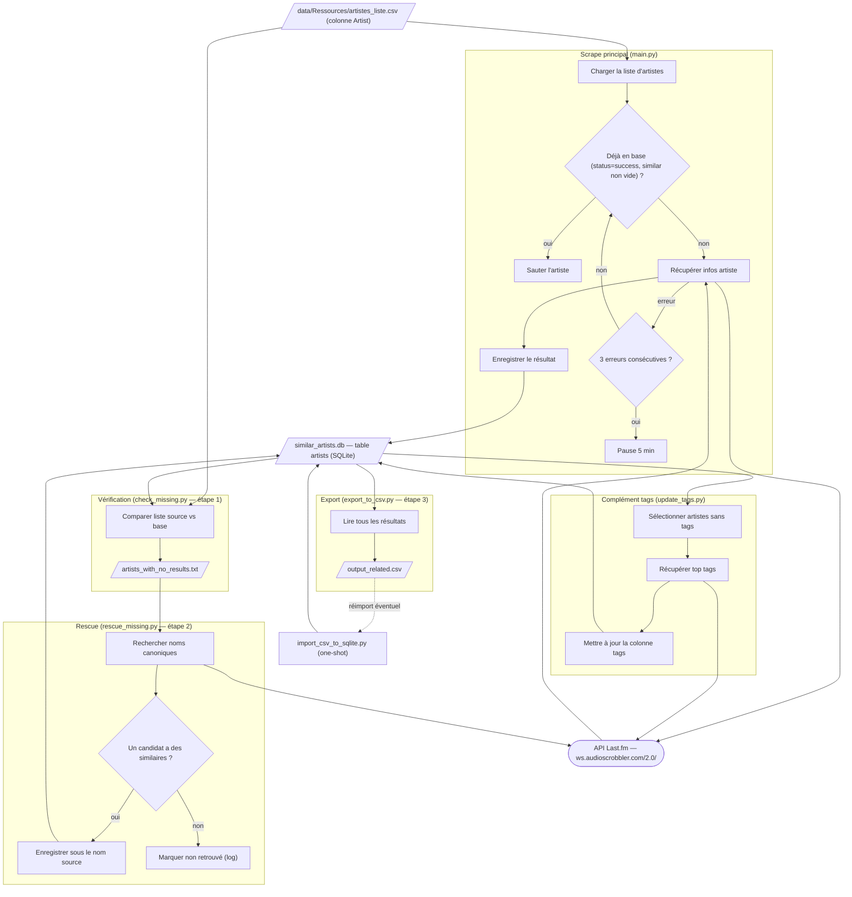

# Service : Artistes_Similaires_LastFM

Scrape l'API Last.fm pour constituer une base de données d'artistes similaires et de genres musicaux.

---

## Objectif

Pour chaque artiste d'une liste source, récupérer via l'API Last.fm :
- Jusqu'à **20 artistes similaires** avec leur score de similarité (0.0 → 1.0)
- Jusqu'à **5 genres** (tags Last.fm)

Les résultats sont stockés dans une base SQLite avec reprise automatique en cas d'interruption.

---

## Schéma fonctionnel



### Détail des actions

1. **Charger la liste d'artistes** — `main.load_artists()` lit `data/Ressources/artistes_liste.csv` avec pandas et exige la colonne `Artist` (sinon `ValueError`). Vérifie aussi la présence de `LASTFM_API_KEY` (chargée depuis `.env` via `python-dotenv`). Input : `artistes_liste.csv` → output : liste Python d'artistes.

2. **Tester si déjà en base (idempotence / reprise)** — `Database.artist_exists()` interroge `SELECT similar_artists FROM artists WHERE source_artist = ? AND status = 'success'` ; renvoie vrai seulement si le JSON `similar_artists` décodé est une liste non vide. Permet au scraper de reprendre exactement là où il s'est arrêté en sautant les artistes déjà traités (log « Skipping … »).

3. **Récupérer infos artiste** — `LastFmAPIClient.get_artist_info(artist, similar_limit=20, tags_limit=5)` enchaîne deux appels via `_make_request()` : `artist.getsimilar` (`limit=20`, `autocorrect=1`) puis `artist.gettoptags` (`autocorrect=1`). Construit pour chaque similaire `{name, mbid, match, rank}` (rang attribué dans l'ordre de retour) et garde les 5 premiers tags. Sur HTTP 429, attend 5 s et retente une fois (`_make_request`). Output : dict `{"similar_artists": [...], "tags": [...]}`.

4. **Enregistrer le résultat** — `Database.save_result()` fait un `INSERT … ON CONFLICT(source_artist) DO UPDATE` dans la table `artists` (colonnes `source_artist` PK, `similar_artists` et `tags` sérialisés en JSON, `status='success'`). Après succès, `main` remet à zéro le compteur d'erreurs et attend 0,5 s (respect du rate limit ~5 req/s).

5. **Gérer les erreurs consécutives** — dans la boucle de `main`, chaque exception incrémente `consecutive_errors` ; à 3 erreurs d'affilée (`max_consecutive_errors`), pause de 5 min (`time.sleep(300)`) puis remise à zéro. Boucle interruptible par `Ctrl+C` (`KeyboardInterrupt`), avec fermeture propre de la connexion SQLite dans le `finally`.

6. **Compléter les tags manquants** — `update_tags.py` (étape facultative, hors `run_pipeline.sh`) sélectionne via `get_artists_without_tags()` les lignes `status='success'` dont `tags` est NULL/`'[]'`/`''`, appelle directement `artist.gettoptags` (`autocorrect=1`, 5 premiers tags) et écrit la colonne `tags` avec `UPDATE artists SET tags=? WHERE source_artist=?`, sans toucher aux `similar_artists`. Même logique de pause 0,5 s et de pause 5 min après 3 erreurs.

7. **Vérifier les artistes manquants (pipeline étape 1)** — `check_missing.py` charge l'ensemble des `Artist` du CSV source et l'ensemble des `source_artist` ayant des similaires non vides via `Database.get_all_results()`, calcule la différence et écrit les noms triés dans `data/Artistes_Similaires_LastFM/artists_with_no_results.txt`.

8. **Rescue des manquants (pipeline étape 2)** — `rescue_missing.py` lit `artists_with_no_results.txt` et, pour chaque nom, appelle `artist.search` (`LastFmAPIClient.search_artist`, `limit=5`) pour obtenir des noms candidats ; teste chaque candidat avec `get_artist_info` et, au premier candidat ayant des similaires non vides, fait `db.save_result(artist, data)` **sous le nom source d'origine**. Sinon log « non trouvé » / « pas d'artiste similaire ». Pause 0,5 s entre artistes.

9. **Exporter vers CSV (pipeline étape 3)** — `export_to_csv.py` lit toute la table via `get_all_results()` et écrit `data/Artistes_Similaires_LastFM/output_related.csv` avec les colonnes `Source_Artist` et `Related_Data_Raw` (liste des similaires sérialisée en chaîne). C'est la dernière étape de `run_pipeline.sh` (qui enchaîne check → rescue → export).

10. **Import one-shot CSV → SQLite** — `import_csv_to_sqlite.py` (hors pipeline) relit `output_related.csv`, parse `Related_Data_Raw` avec `ast.literal_eval`, et réinjecte chaque artiste via `save_result` (avec `tags: []`) en sautant ceux déjà présents (`artist_exists`). Sert à reconstituer/migrer la base depuis un export plat existant.

---

## Architecture des fichiers

```
sources/Artistes_Similaires_LastFM/
├── main.py                  # Scraper principal (boucle sur data/Ressources/artistes_liste.csv)
├── api_client.py            # Client API Last.fm
├── database.py              # Couche SQLite
├── check_missing.py         # Étape 1 du pipeline : identifie les artistes manquants
├── rescue_missing.py        # Étape 2 : tente de retrouver les artistes non trouvés
├── export_to_csv.py         # Étape 3 : exporte SQLite → CSV
├── import_csv_to_sqlite.py  # One-shot : importe un CSV existant dans la DB
├── run_pipeline.sh          # Lance les 3 étapes en séquence
└── requirements.txt
```

---

## Données

### Input

**`data/Ressources/artistes_liste.csv`** (partagé entre tous les services)

CSV avec une colonne `Artist`. Généré automatiquement par `A_Recuperer --extract-artists` à partir des playlists. Peut aussi être complété manuellement.

### Output

**`data/Artistes_Similaires_LastFM/similar_artists.db`** (source de vérité)

Base SQLite avec une table `artists` :

| Colonne | Type | Description |
|---|---|---|
| `source_artist` | TEXT PK | Nom de l'artiste source |
| `similar_artists` | TEXT | JSON : liste de `{name, mbid, match, rank}` |
| `tags` | TEXT | JSON : liste de noms de genres |
| `status` | TEXT | `success` |

**`data/Artistes_Similaires_LastFM/output_related.csv`**

Export plat de la base SQLite :

| Colonne | Description |
|---|---|
| `Source_Artist` | Artiste source |
| `Related_Data_Raw` | Liste des artistes similaires avec scores |

---

## Commandes

```bash
cd sources/Artistes_Similaires_LastFM

# Scraper principal (reprend là où il s'est arrêté)
uv run python main.py

# Pipeline complet : vérification + rescue + export CSV
bash run_pipeline.sh

# Étapes séparées
uv run python check_missing.py    # → data/Artistes_Similaires_LastFM/artists_with_no_results.txt
uv run python rescue_missing.py   # Tente de retrouver les artistes manquants
uv run python export_to_csv.py    # → data/Artistes_Similaires_LastFM/output_related.csv
```

**Comportement du scraper :**
- Saute les artistes déjà en base (`status = 'success'` avec résultats non vides)
- Pause 0.5 s entre chaque artiste (respect du rate limit Last.fm ~5 req/s)
- Pause 5 min après 3 erreurs consécutives
- Interruptible avec Ctrl+C, reprend proprement

---

## API Last.fm

| Méthode | Paramètre | Description |
|---|---|---|
| `artist.getsimilar` | `artist`, `limit=20`, `autocorrect=1` | Artistes similaires avec scores 0–1 |
| `artist.gettoptags` | `artist`, `autocorrect=1` | Top 5 genres |
| `artist.search` | `artist`, `limit=5` | Recherche par nom (pour rescue) |

**Authentification :** `LASTFM_API_KEY` dans `.env`

---

## Installation

```bash
cd sources/Artistes_Similaires_LastFM
uv venv .venv --python 3.12
uv pip install -r requirements.txt
```

Obtenir une clé API : https://www.last.fm/api/account/create

---

## Ajouter des artistes

Ajouter les noms dans `data/Ressources/artistes_liste.csv` (colonne `Artist`), puis relancer `main.py`. Les nouveaux artistes sont traités en priorité (les existants sont skippés). Pour régénérer la liste depuis les playlists : `uv run python main.py --extract-artists` depuis `sources/A_Recuperer`.
