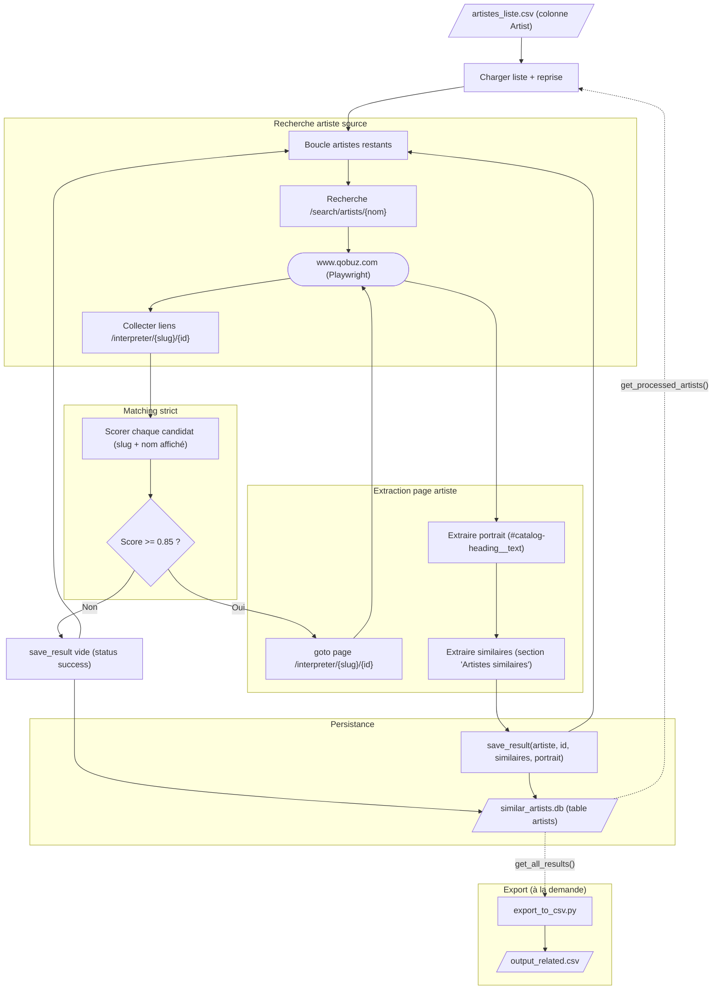

# Service : Artistes_Similaires_Qobuz

Scrape la section **"Artistes similaires"** et le **Portrait** (biographie) de
Qobuz pour enrichir la base de similarités, en complément de Last.fm et Spotify.

---

## Objectif

Pour chaque artiste d'une liste source, récupérer via le web Qobuz (sans
authentification) :
- La liste ordonnée des **artistes similaires** (1 = le plus proche)
- L'**ID Qobuz** de l'artiste source (pour générer des liens)
- Le **portrait** : biographie/présentation Qobuz, si exposée publiquement

Qobuz, comme Spotify, ne fournit pas de score numérique — seul le rang
d'apparition est disponible.

---

## Schéma fonctionnel



### Détail des actions
1. **Charger liste + reprise** — `main()` (main.py) lit `data/Ressources/artistes_liste.csv` via pandas (`df_input["Artist"].dropna().unique()`), puis interroge `Database.get_processed_artists()` (database.py) qui renvoie le set de toutes les `source_artist` déjà présentes en table `artists`. `remaining = all_artists − processed`, ce qui permet de reprendre exactement où le scraper s'est arrêté (un Ctrl+C puis relance ne retraite pas les artistes déjà enregistrés). Sortie immédiate si `remaining` est vide.
2. **Boucle artistes restants** — boucle Playwright (`sync_playwright`) avec sessions navigateur rotatives : chaque navigateur Chromium (stealth, user-agent Windows/Chrome 120, viewport 1920×1080, locale fr-FR) traite entre 15 et 25 artistes (`session_limit = random.randint(15, 25)`) avant restart, avec délais aléatoires de 2–5 s entre artistes. En cas de crash réseau, `wait_for_internet()` attend le rétablissement (ping 8.8.8.8:53).
3. **Recherche /search/artists/{nom}** — `find_artist_page()` navigue (`page.goto`, `wait_until="domcontentloaded"`, timeout 20 s) vers `https://www.qobuz.com/fr-fr/search/artists/{q}` (nom URL-encodé). On utilise `www.qobuz.com` (miroir SEO public, HTML rendu serveur) et non `play.qobuz.com` (SPA login-walled). Le bandeau cookies est fermé (`#didomi-notice-agree-button`).
4. **Collecter liens /interpreter/** — `page.evaluate` ramasse tous les `a[href*='/interpreter/']`, dédoublonne par href, et pour chacun extrait le nom affiché (attribut `title` > `span.name`/`.artist-name`/`.catalog-heading__name` > textContent). Input → output : nom cible → liste de candidats `{href, displayName}`.
5. **Scorer chaque candidat** — pour chaque href, la regex `INTERPRETER_RE = /interpreter/([^/]+)/(\d+)` extrait `slug` et `qobuz_id`. Le score = `max(name_similarity(displayName, cible), name_similarity(slug→espaces, cible))`, où `name_similarity` normalise en ASCII/minuscules (`normalize_text`) puis applique `difflib.SequenceMatcher().ratio()`, avec score forcé à 1.0 si égalité exacte après normalisation. On garde le candidat au meilleur score.
6. **Décision Score >= 0.85 ?** — seuil strict `NAME_MATCH_THRESHOLD = 0.85` (vs ~0.5 dans l'ancien `check_artist_presence` qui matchait dès 1 token commun et confondait les homonymes type "Worakls"/"Kevin Worakls"). Sous le seuil → artiste considéré non trouvé.
7. **save_result vide (non trouvé)** — si pas de match strict, `db.save_result(artist, "", [], portrait="")` enregistre quand même une entrée `status='success'` (id vide, similaires `[]`) pour ne pas retomber dessus à la reprise ; l'artiste est ajouté à `processed`.
8. **goto page /interpreter/{slug}/{id}** — `extract_artist_data()` navigue vers l'URL artiste retenue (préfixée `https://www.qobuz.com` si relative), `domcontentloaded`, timeout 20 s, ferme le bandeau cookies. En cas de timeout, retourne `{portrait: "", similar: []}`.
9. **Extraire portrait** — `page.locator("#catalog-heading__text").first` (un **id**) ; texte récupéré via `text_content()` (ignore la visibilité, donc capte le texte tronqué CSS par la checkbox `#expand-toggle`/"Lire la suite" sans clic), puis whitespaces compressés (`re.sub(r"\s+", " ")`). Champ vide si l'artiste n'a pas de bio publique.
10. **Extraire similaires** — `page.evaluate` localise le `h3.catalog-heading__subtitle` dont le texte commence par "artistes similaires", remonte au `.catalog-heading` parent le plus proche (scope strict pour éviter d'autres carrousels), puis liste les `a.catalog-heading__item` ; pour chacun, `span.catalog-heading__name` (nom) et href → `slug`/`qobuz_id` via `INTERPRETER_RE`, avec un `rank` séquentiel (1 = le plus proche). Qobuz expose ~5 à ~80 similaires.
11. **save_result (succès)** — `db.save_result(artist, qobuz_id, similar_dicts, portrait)` fait un `INSERT … ON CONFLICT(source_artist) DO UPDATE` dans la table `artists(source_artist PK, source_artist_id, similar_artists, portrait, tags='[]', status='success')`. `similar_artists` est sérialisé en JSON `[{"name", "id", "rank"}, …]`. Commit immédiat ; artiste ajouté à `processed`.
12. **export_to_csv.py (à la demande)** — script séparé : `Database.get_all_results()` (lignes `status='success'`) → DataFrame pandas écrit en `data/Artistes_Similaires_Qobuz/output_related.csv` avec colonnes `Source_Artist`, `Source_Artist_ID`, `Related_Data_Raw` (liste `[{"name", "id"}]` désérialisée du JSON), `Portrait`. La DB SQLite reste la source de vérité ; le CSV n'est qu'un dérivé pour lecture humaine.

---

## Pourquoi `www.qobuz.com` et pas `play.qobuz.com` ?

`play.qobuz.com` est la SPA (web app) de lecture, **réservée aux abonnés**.
Sans login, on n'a accès qu'à la page d'accueil générique.

`www.qobuz.com` (le miroir SEO) expose les mêmes pages artistes en HTML rendu
côté serveur, **accessible sans compte**. Le service `A_Recuperer` utilise déjà
ce subdomain pour trouver les liens d'albums. On suit le même principe.

L'URL d'un artiste sur `www.qobuz.com` est :

    https://www.qobuz.com/fr-fr/interpreter/{slug}/{id}

L'ID est différent de celui de `play.qobuz.com` (ex. Worakls = `525535` sur
www, `3586950` sur play). On stocke celui de www.qobuz.com.

---

## Différences avec Last.fm / Spotify

| Critère | Last.fm | Spotify | Qobuz |
|---|---|---|---|
| Source | API officielle | Scraping web (login pour play) | Scraping web (public) |
| Similarité | Score 0–1 | Rang 1–40 | Rang 1–~80 |
| Genres / tags | Oui | Genre principal | Non exposé |
| Bio / portrait | Non | Non | **Oui** (texte de présentation) |
| ID artiste | MusicBrainz ID | Spotify ID (22 chars) | ID numérique Qobuz |
| Vitesse | ~0.5 s/artiste | ~5–10 s/artiste | ~5–8 s/artiste |
| Robustesse | Très stable | Sensible aux anti-bots | Stable (pas d'auth) |

---

## Architecture des fichiers

```
sources/Artistes_Similaires_Qobuz/
├── main.py                  # Scraper principal (écrit dans la DB SQLite)
├── database.py              # Wrapper SQLite (interface alignée Last.fm/Spotify)
├── export_to_csv.py         # Export DB → CSV (dérivé pour lecture humaine)
├── pyproject.toml
└── requirements.txt
```

---

## Données

### Input

**`data/Ressources/artistes_liste.csv`** — partagé entre tous les services
de scraping (cf. `A_Recuperer --extract-artists`).

### Output (source de vérité)

**`data/Artistes_Similaires_Qobuz/similar_artists.db`** — base SQLite avec le
même schéma que Last.fm + Spotify, plus un champ `portrait` :

```sql
CREATE TABLE artists (
    source_artist TEXT PRIMARY KEY,
    source_artist_id TEXT,        -- ID Qobuz numérique (ex. "525535")
    similar_artists TEXT,          -- JSON : [{"name": ..., "id": ..., "rank": ...}]
    portrait TEXT,                 -- biographie / présentation Qobuz
    tags TEXT DEFAULT '[]',        -- non exposé côté Qobuz, gardé pour symétrie
    status TEXT DEFAULT 'success'
);
```

### Output (dérivé)

**`data/Artistes_Similaires_Qobuz/output_related.csv`** — généré par
`export_to_csv.py` quand on en a besoin pour inspection humaine.

---

## Algorithme de matching strict

> **Coquille corrigée** — la fonction `check_artist_presence` du scraper
> existant (`A_Recuperer/utils/scraper.py`) acceptait un match dès **1 token**
> commun, ce qui causait des confusions ("Worakls" matchait "Kevin Worakls",
> par exemple). Le service Qobuz utilise un matching plus strict.

1. Recherche : `https://www.qobuz.com/fr-fr/search/artists/{nom}`
2. Récupération de tous les liens `/interpreter/{slug}/{id}`
3. Pour chaque candidat, calcul de la similarité de nom :
   - Sur le slug normalisé (espaces, ASCII, minuscules)
   - Sur le texte affiché (titre du lien)
   - Score retenu = max des deux
4. Seuil strict `NAME_MATCH_THRESHOLD = 0.85` (vs ~0.5 dans l'ancien scraper).
   Sous le seuil → l'artiste est considéré "non trouvé".
5. Match exact (après normalisation) → score forcé à 1.0.

---

## Extraction sur la page artiste

### Portrait

Le texte complet est dans `#catalog-heading__text` (un **id**, pas une classe).
Il est tronqué visuellement par CSS via une checkbox `#expand-toggle` et un label
"Lire la suite", mais **entièrement présent dans le DOM dès le chargement**.

On utilise `text_content()` (qui ignore la visibilité) plutôt que `inner_text()`
pour récupérer le texte complet sans avoir à cliquer "Lire la suite".

### Artistes similaires

Section délimitée par `h3.catalog-heading__subtitle` contenant le texte
"Artistes similaires". On scope **strictement** au `.catalog-heading` parent
le plus proche pour éviter de capturer d'autres carrousels d'artistes
ailleurs sur la page.

Chaque item suit la structure :

```html
<a class="catalog-heading__item" href="/fr-fr/interpreter/{slug}/{id}">
    <span class="catalog-heading__name">Nom de l'artiste</span>
</a>
```

Selon la popularité de l'artiste source, Qobuz retourne entre ~5 et ~80
similaires.

---

## Anti-bot et résilience

Le scraper hérite des bonnes pratiques du service Spotify :

- **Sessions rotatives** : chaque navigateur traite 15 à 25 artistes (random)
  avant restart, pour éviter les patterns détectables
- **Délais aléatoires** : 2 à 5 secondes entre chaque artiste
- **Stealth** : `playwright-stealth` masque les signatures `navigator.webdriver`
  et autres traces d'automatisation
- **Cookie banner** : dismissé automatiquement (`#didomi-notice-agree-button`)
- **Network resilience** : détection de coupure internet et attente du
  rétablissement
- **Reprise propre** : la DB SQLite garde la liste des artistes traités, donc
  un Ctrl+C suivi d'un `uv run python main.py` reprend exactement où on s'est
  arrêté

---

## Commandes

```bash
cd sources/Artistes_Similaires_Qobuz

# Setup (une seule fois)
uv venv .venv --python 3.12
uv pip install -r requirements.txt
uv run playwright install chromium

# Lancer le scraper (reprend là où il s'est arrêté)
uv run python main.py

# Mode visible pour debug
HEADLESS=false uv run python main.py

# Exporter la DB vers le CSV (lecture humaine / sauvegarde Git-friendly)
uv run python export_to_csv.py
```

---

## Intégration au service Recommandation

Qobuz devient une **3e source de similarité** pondérée. Le score combiné
devient :

    score(c) = α_lfm × s_lastfm(c) + α_spt × s_spotify(c) + α_qbz × s_qobuz(c)

avec `α_spt = max(0, 1 − α_lfm − α_qbz)` (déduit). Côté UI Streamlit, deux
sliders : poids Last.fm et poids Qobuz ; le poids Spotify s'affiche en
"effectif".

Le portrait Qobuz est propagé sur chaque recommandation et affiché en
expander dans la carte de détails.

Le rang Qobuz est converti en score linéairement, comme Spotify mais avec
une échelle plus large (`QOBUZ_MAX_RANK = 50` car Qobuz expose plus de
similaires que Spotify) :

    qobuz_rank_to_score(rang) = max(0, 1 − (rang − 1) / 50)

---

## Limites connues

- Pas tous les artistes ont un portrait public sur `www.qobuz.com` (les bios
  sont parfois exclusives à `play.qobuz.com`). Le champ `portrait` est alors
  vide, ce qui est traité comme "pas de bio à afficher".
- Le matching à 0.85 peut rater des artistes aux noms très courts (ex. "N'to"
  vs slug "nto" → score 0.857... techniquement OK mais limite). Si beaucoup
  de matches échouent, on peut baisser le seuil à 0.80.
- Qobuz ne fournit pas de tags / genres. La diversification MMR de
  Recommandation reste basée sur les tags Last.fm.
