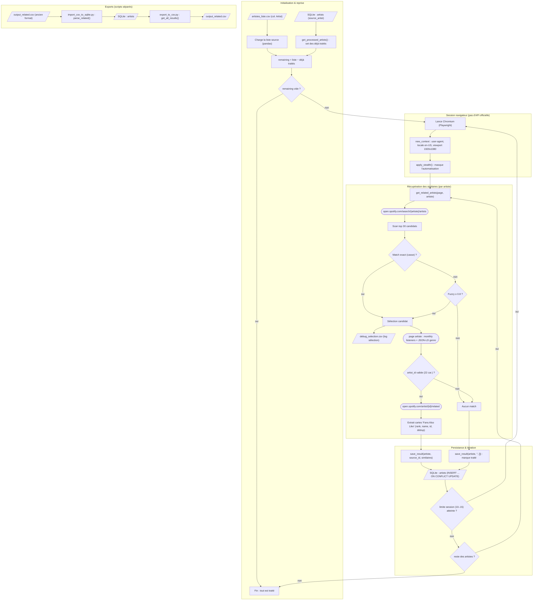

# Service : Artistes_Similaires_Spotify

Scrape la section **"Fans Also Like"** de Spotify pour constituer une base d'artistes similaires, enrichie du genre et des auditeurs mensuels.

---

## Objectif

Pour chaque artiste d'une liste source, récupérer via le web Spotify (sans API officielle) :
- La liste ordonnée des **artistes suggérés** ("Fans Also Like"), avec leur ID Spotify
- Le **rang** de chaque artiste (1 = le plus proche)
- Le **genre** (extrait du JSON-LD de la page)
- Les **auditeurs mensuels**

Contrairement au service Last.fm qui expose un score de similarité 0–1, Spotify ne fournit pas de score public : le rang d'apparition est l'indicateur de proximité.

---

## Schéma fonctionnel



### Détail des actions

1. **Chargement de la liste source** — `main()` (main.py) lit `data/Ressources/artistes_liste.csv` via `pandas.read_csv`, prend la colonne `Artist` dédupliquée. Input → liste de noms d'artistes à traiter.
2. **Reprise / idempotence** — `Database.get_processed_artists()` (database.py) lit `SELECT source_artist FROM artists` et renvoie l'ensemble des noms déjà présents. `remaining` = liste source moins les déjà traités, donc le run reprend exactement où il s'était arrêté. Si `remaining` est vide, le programme s'arrête.
3. **Pas d'API officielle / auth navigateur** — il n'y a pas de token OAuth Spotify : le service fait du scraping web via Playwright. `p.chromium.launch(headless=…, --disable-blink-features=AutomationControlled)`, puis `new_context` avec `user_agent` Chrome fixe, `locale="en-US"`, viewport 1920x1080, et `apply_stealth(page)` (playwright-stealth) pour réduire la détection anti-bot. Une session navigateur traite un lot aléatoire de 10–15 artistes (`session_limit`) puis le navigateur est relancé (rotation anti-détection).
4. **Recherche de l'artiste source** — `get_related_artists()` navigue vers `https://open.spotify.com/search/{artiste}/artists` (suffixe `/artists` pour forcer les profils artistes), attend `networkidle`, récupère les liens `a[href^="/artist/"]` et scanne au plus 30 candidats.
5. **Sélection du bon candidat** — match exact insensible à la casse prioritaire ; sinon fuzzy matching `difflib.SequenceMatcher` avec seuil `NAME_MATCH_THRESHOLD = 0.8`, on garde le meilleur score. Chaque décision est journalisée dans `data/Artistes_Similaires_Spotify/debug_selection.csv` (Input_Name, Selected_Name, Rank, Score, URL, Timestamp). Sans candidat valide → `(None, None)`.
6. **Extraction des métadonnées source** — sur la page artiste : `Monthly_Listeners` extrait du bloc `div:has-text("monthly listeners")` (via `extract_number`), `Genre` lu dans le `script[type="application/ld+json"]` (clé `genre`, directement ou sous `@graph` → `MusicGroup`). L'`artist_id` est extrait de l'URL et validé contre `^[a-zA-Z0-9]{22}$` ; invalide → abandon de l'artiste.
7. **Extraction "Fans Also Like"** — navigation vers `https://open.spotify.com/artist/{artist_id}/related`, parcours des cartes `main a[href^="/artist/"]` ; pour chacune : `Rank` (ordre d'apparition = proximité, pas de score), `Name`, `ID` Spotify (validé + dédupliqué via `seen_ids`), plus `Source_Genre`/`Source_Listeners`. Renvoie `(artist_id, related)`.
8. **Persistance SQLite** — `Database.save_result(artist_name, source_artist_id, similar_artists)` (database.py) fait un `INSERT INTO artists … ON CONFLICT(source_artist) DO UPDATE` dans `data/Artistes_Similaires_Spotify/similar_artists.db`. La table `artists` a pour colonnes `source_artist` (clé primaire), `source_artist_id` (ID Spotify 22 car. ou ""), `similar_artists` (JSON `[{name,id,rank}]`), `tags` (toujours `'[]'`, gardé pour symétrie avec Last.fm), `status` (`'success'`). Si aucun match, on enregistre quand même `save_result(artist, "", [])` pour ne pas re-tenter en boucle.
9. **Itération et robustesse** — délai aléatoire 2–5 s entre artistes ; à la limite de session le navigateur est relancé ; en cas de crash navigateur/réseau, `wait_for_internet()` attend le rétablissement (ping `8.8.8.8:53`) avant de reprendre. La boucle continue tant que `remaining` n'est pas vide.
10. **Export CSV (dérivé)** — `export_to_csv.py` appelle `Database.get_all_results()` (`SELECT source_artist, source_artist_id, similar_artists WHERE status='success'`) et écrit `output_related.csv` (colonnes `Source_Artist`, `Source_Artist_ID`, `Related_Data_Raw` au format `str(list[dict])`, sans le rank). La DB reste la source de vérité ; ce CSV est un dérivé pour lecture humaine.
11. **Migration one-shot (sens inverse)** — `import_csv_to_sqlite.py` lit l'ancien `output_related.csv`, parse `Related_Data_Raw` via `ast.literal_eval` (`parse_related()`) et réinjecte dans la DB via `save_result` ; idempotent grâce au `ON CONFLICT DO UPDATE`. Option `--dry-run` pour prévisualiser sans écrire.

---

## Différences avec Artistes_Similaires_LastFM

| Critère | LastFM | Spotify |
|---|---|---|
| Source | API officielle | Scraping web |
| Similarité | Score 0–1 | Rang (1 = plus proche) |
| Genres | Tags Last.fm | JSON-LD page artiste |
| Auditeurs mensuels | Non | Oui |
| ID artiste | MusicBrainz ID | Spotify ID (22 chars) |
| Vitesse | ~0.5 s/artiste | ~5–10 s/artiste |
| Robustesse | Très stable | Dépend des anti-bots Spotify |

---

## Architecture des fichiers

```
sources/Artistes_Similaires_Spotify/
├── main.py                   # Scraper principal (écrit dans la DB SQLite)
├── database.py               # Wrapper SQLite (interface alignée sur Last.fm)
├── import_csv_to_sqlite.py   # Migration one-shot de l'ancien output_related.csv
├── export_to_csv.py          # Export DB → CSV (CSV = dérivé pour lecture humaine)
├── pyproject.toml
└── requirements.txt
```

---

## Données

### Input

**`data/Ressources/artistes_liste.csv`** (partagé entre tous les services)

CSV avec une colonne `Artist`. Généré par `A_Recuperer --extract-artists` à partir des playlists.

### Output (source de vérité)

**`data/Artistes_Similaires_Spotify/similar_artists.db`** — base SQLite.

Schéma aligné sur le service Last.fm pour faciliter la maintenance :

```sql
CREATE TABLE artists (
    source_artist TEXT PRIMARY KEY,
    source_artist_id TEXT,        -- ID Spotify (22 chars), spécifique au service Spotify
    similar_artists TEXT,          -- JSON : [{"name": ..., "id": ..., "rank": ...}]
    tags TEXT DEFAULT '[]',        -- toujours [] côté Spotify (pas exposé), gardé pour symétrie
    status TEXT DEFAULT 'success'
);
```

> 🔁 **Unification du stockage** — depuis le refactor SQLite, Last.fm et Spotify
> partagent la même structure de table (à un champ `source_artist_id` près,
> spécifique à Spotify). Le service Recommandation lit indifféremment les deux
> via `engine.load_lastfm_similar()` / `engine.load_spotify_similar()`.

### Output (dérivé)

**`data/Artistes_Similaires_Spotify/output_related.csv`** — généré par
`export_to_csv.py`. Mêmes colonnes que l'ancien format historique. Utile pour
inspection humaine ou compatibilité avec d'éventuels scripts externes.

**`data/Artistes_Similaires_Spotify/debug_selection.csv`** — log de sélection :
pour chaque artiste cherché, indique quel candidat a été retenu, son rang dans
les résultats, son score de similarité de nom et l'URL.

---

## Commandes

```bash
cd sources/Artistes_Similaires_Spotify

# Lancer le scraper (reprend là où il s'est arrêté, via la DB)
uv run python main.py

# Mode visible (non headless) pour débogage
HEADLESS=false uv run python main.py

# Exporter la DB vers le CSV (pour lecture humaine / sauvegarde Git-friendly)
uv run python export_to_csv.py

# Migration one-shot : ancien CSV → nouvelle DB SQLite (à ne lancer qu'une fois,
# au moment de basculer une base existante)
uv run python import_csv_to_sqlite.py --dry-run    # preview
uv run python import_csv_to_sqlite.py              # applique
```

**Comportement :**
- Reprend automatiquement : les artistes déjà en DB sont skippés au démarrage
- Sessions de 10–15 artistes par instance de navigateur (rotation pour éviter la détection)
- Délai aléatoire 2–5 s entre chaque artiste
- En cas de coupure internet : pause et attente automatique du rétablissement
- Utilise `playwright-stealth` pour masquer l'automatisation

---

## Algorithme de recherche

1. Navigation vers `https://open.spotify.com/search/{artiste}/artists`
   - Le suffixe `/artists` force l'affichage de profils artistes (évite albums/chansons homonymes)
2. Scan des 30 premiers résultats :
   - Correspondance exacte (insensible à la casse) → priorité immédiate
   - Sinon : fuzzy matching (seuil 80%) → meilleur score retenu
3. Clic sur le profil sélectionné → extraction genre + auditeurs mensuels
4. Navigation vers `https://open.spotify.com/artist/{id}/related` → extraction "Fans Also Like"

---

## Installation

```bash
cd sources/Artistes_Similaires_Spotify
uv venv .venv --python 3.12
uv pip install -r requirements.txt
uv run playwright install chromium   # à faire une seule fois
```

---

## Ajouter des artistes

Ajouter les noms dans `data/Ressources/artistes_liste.csv` (colonne `Artist`), puis relancer `main.py`. Les noms déjà présents en DB sont automatiquement ignorés au démarrage. Pour régénérer depuis les playlists : `uv run python main.py --extract-artists` depuis `sources/A_Recuperer`.

---

## Limites connues

- Spotify peut détecter et bloquer le scraping → le script redémarre le navigateur mais peut nécessiter une surveillance manuelle sur de longues sessions
- Le genre extrait via JSON-LD n'est pas toujours présent (dépend de l'artiste)
- Les auditeurs mensuels sont une valeur visuelle, non structurée
