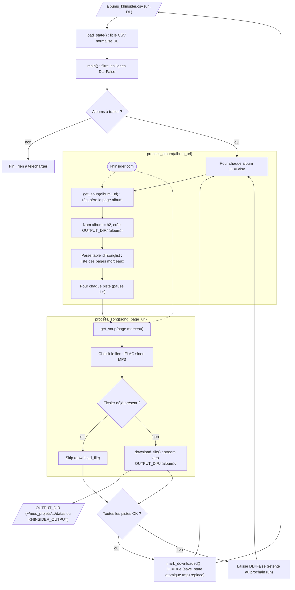

# Service : Musique_Jeux_Video

Scraper [khinsider.com](https://downloads.khinsider.com/) pour télécharger
des bandes originales de jeux vidéo.

---

## Objectif

> *"Récupérer des OST de jeux vidéo en lot, en privilégiant la qualité FLAC,
> avec un suivi simple de ce qui est déjà téléchargé."*

---

## Schéma fonctionnel



### Détail des actions
1. **Charger l'état** — `load_state()` lit `data/Musique_Jeux_Video/albums_khinsider.csv` (colonnes `url`, `DL`), ajoute `DL=False` si la colonne manque (legacy), normalise `DL` via `_coerce_bool` (`true/1/yes/y/oui` → True) et nettoie les URLs. Ce CSV est la **source de vérité** de ce qui est déjà téléchargé.
2. **Filtrer les albums à traiter** — `main()` sélectionne `todo = df[~df["DL"]]` (lignes `DL=False`). Crée `OUTPUT_DIR` (par défaut `~/mes_projets/Musique_Jeux_Video/datas/`, surchargeable par la variable d'env `KHINSIDER_OUTPUT`). Si tout est à `DL=True`, s'arrête sans rien faire (idempotence au niveau album).
3. **Récupérer la page album** — `process_album(album_url)` appelle `get_soup()` (requête `requests.get` avec User-Agent navigateur, parsing BeautifulSoup) sur l'URL khinsider. Déduit le nom d'album depuis la balise `<h2>` (fallback : dernier segment d'URL) et crée le sous-dossier `OUTPUT_DIR/<Nom de l'album>/`.
4. **Lister les pistes** — Parse la table `id="songlist"`, ignore `songlist_header`, extrait pour chaque ligne le lien de la cellule `clickable-row` (préfixe `BASE_URL=https://downloads.khinsider.com` si relatif), puis `sorted(set(...))` pour dédoublonner.
5. **Traiter chaque piste** — `process_song(song_page_url, album_dir)` charge la page du morceau, scanne les `<a>` pour trouver « click here to download as flac » puis « as mp3 ». **Privilégie FLAC, sinon MP3** (`download_url = flac_link or mp3_link`). Nom de fichier = dernier segment de l'URL (décodé via `unquote`).
6. **Télécharger le fichier (idempotent)** — `download_file(url, filepath)` : si le fichier existe déjà dans le dossier album, il est **skippé** (reprise au niveau fichier, même si `DL=False`) ; sinon téléchargement en streaming (chunks de 8192 octets) vers `OUTPUT_DIR/&lt;album&gt;/`. Pause `time.sleep(1)` entre chaque piste pour ménager le serveur.
7. **Marquer l'album** — Si **toutes** les pistes réussissent (`all_ok`), `mark_downloaded()` passe la ligne à `DL=True` et réécrit le CSV via `save_state()` (**écriture atomique** : `tmp + replace`, robuste aux interruptions). En cas d'échec partiel, la ligne reste `DL=False` et l'album est retenté au prochain run (fichiers déjà OK re-skippés individuellement).

---

## Architecture des fichiers

```
sources/Musique_Jeux_Video/
├── main.py             # Scraper khinsider
├── pyproject.toml
└── requirements.txt
```

---

## Données

### Input + état (source de vérité unique)

**`data/Musique_Jeux_Video/albums_khinsider.csv`** — deux colonnes :

| Colonne | Type | Rôle |
|---|---|---|
| `url` | str | URL khinsider de l'album (ex. `https://downloads.khinsider.com/game-soundtracks/album/cuphead`) |
| `DL` | bool | `True` = déjà téléchargé (le service skippe), `False` = à télécharger |

Quand un album est téléchargé avec succès, sa ligne passe automatiquement à
`DL=True` (écriture atomique du CSV : tmp + replace, robuste aux interruptions).

Exemple :
```csv
url,DL
https://downloads.khinsider.com/game-soundtracks/album/cuphead,True
https://downloads.khinsider.com/game-soundtracks/album/celeste,False
```

### Output (audio)

Stocké **en dehors du repo** (volumes en GB) :

- Par défaut : `~/mes_projets/Musique_Jeux_Video/datas/<Nom de l'album>/`
- Configurable via la variable d'env `KHINSIDER_OUTPUT`

```bash
# Surcharger l'emplacement
KHINSIDER_OUTPUT=/mnt/d/Musiques_Jeux uv run python main.py
```

Un sous-dossier par album avec les pistes (FLAC en priorité, MP3 sinon).

---

## Commandes

```bash
cd sources/Musique_Jeux_Video
uv venv .venv --python 3.12
uv pip install -r requirements.txt

# Lancer le scraper
uv run python main.py
```

---

## Comportement

- **Source de vérité** : la colonne `DL` du CSV. Modifier le CSV à la main est
  parfaitement OK (passer une ligne à `False` la fait re-télécharger, à `True`
  la fait skip).
- **Reprise au niveau du fichier** : un fichier déjà présent dans le dossier
  album est skippé (pas de re-téléchargement même si `DL=False`).
- **Marquage** : un album n'est marqué `DL=True` que si **toutes** ses pistes
  sont téléchargées sans erreur. En cas d'échec partiel, la ligne reste
  `DL=False` et l'album sera retenté au prochain run.
- **FLAC > MP3** : privilégie les pistes FLAC quand disponibles.
- **Pause 1 s entre chaque piste** pour ménager le serveur.

---

## Ajouter un album

1. Trouver l'URL de l'album sur khinsider.com
   (ex. `https://downloads.khinsider.com/game-soundtracks/album/<slug>`)
2. Ajouter une ligne dans `data/Musique_Jeux_Video/albums_khinsider.csv` avec
   `DL=False`
3. Relancer `uv run python main.py`

---

## Limites connues

- Pas de gestion d'authentification (tous les albums khinsider gratuits sont accessibles)
- Pas de filtrage sur les fichiers parasites (artwork, infos texte) — ils
  finissent dans le dossier album si khinsider les expose
- En cas de coupure réseau au milieu d'un album : le `DL` reste `False`, le
  prochain run re-tentera depuis le début (les fichiers déjà OK sont skippés
  individuellement)
