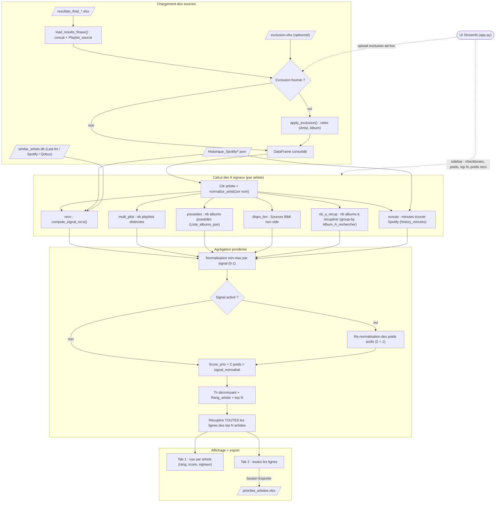

# Service : Priorisation

Interface Streamlit qui consomme les fichiers `data/Resultats/resultats_final_*.xlsx`
(générés par `A_Recuperer --consolidate`) et liste les **top N artistes
prioritaires** à récupérer, en agrégeant toutes leurs lignes (= tous leurs
albums à récupérer) sous forme exportable.

---

## Objectif

Répondre à la question : **dans tout ce qu'il me reste à acheter/emprunter,
par quoi je commence ?**

Le service combine 6 signaux par artiste, normalise et pondère, puis remonte
les N artistes les mieux classés. Pour ces N artistes, **toutes leurs lignes**
de `resultats_final_*.xlsx` sont restituées (= on traite tous les albums d'un
même artiste d'un coup, pas d'aller-retour).

---

## Schéma fonctionnel



### Détail des actions

1. **Lancement de l'UI** — `app.py` (Streamlit, `uv run streamlit run app.py`, port 8509). La sidebar expose, pour chacun des 6 `SIGNAL_NAMES`, une case à cocher (`signals_enabled`) + un slider de poids (`signal_weights`), un slider `Top N artistes` (5–200, défaut 50), deux sliders internes au signal `reco` (poids Last.fm défaut 0.40, poids Qobuz défaut 0.20, poids Spotify déduit = `1 − lfm − qbz`), et un `file_uploader` d'exclusion ad-hoc. Ces paramètres sont passés à `compute_priority_scores`.

2. **Chargement des résultats** — `load_results_finaux(RESULTATS_DIR)` (data_loader.py) concatène tous les `data/Resultats/resultats_final_*.xlsx` (dédoublonnés par nom de fichier) et ajoute la colonne `Playlist_source` (= nom du fichier sans le préfixe `resultats_final_`). Sortie : un DataFrame consolidé de toutes les lignes (artiste/album à récupérer + leurs métadonnées).

3. **Filtre d'exclusion** — si un fichier est uploadé dans la sidebar il est lu via `pd.read_excel` (priorité), sinon `load_exclusion(EXCLUSION_DEFAULT)` charge `data/Priorisation/exclusion.xlsx` s'il existe. `apply_exclusion()` retire du DataFrame les lignes dont le couple `(Artist_A_rechercher, Album_A_rechercher)` figure dans l'exclusion (comparaison strip + lower). Appliqué avant tout calcul de signal ; l'UI affiche le nombre de lignes retirées.

4. **Clé artiste** — dans `compute_priority_scores` (engine.py), chaque ligne reçoit `__artist_key = normalize_artist(_split_first(Artist_A_rechercher))` (1er artiste avant la virgule, normalisé), et la liste unique `artist_keys` sert de base à tous les signaux.

5. **Signal `reco`** (poids défaut 0.50) — `compute_signal_reco()` recalcule, pour chaque artiste candidat, le score qu'il aurait dans le moteur de Recommandation : seeds = artistes de l'historique Spotify pondérés par minutes normalisées (`load_history` + `history_minutes`, `/ max`), croisés via index inversé avec les bases de similarité `similar_artists.db` Last.fm (score `match`), Spotify et Qobuz (`spotify_rank_to_score` / `qobuz_rank_to_score`). Combinaison interne `lastfm_weight·lfm + spotify_weight·spt + qobuz_weight·qbz`. Helpers du moteur importés depuis `sources/Recommandation/engine.py` via `importlib`. Ignore le filtre exclusion de Recommandation (recalcul "à la main").

6. **Signal `multi_plist`** (0.15) — `compute_signal_multi_playlists()` : nombre de `Playlist_source` distinctes où l'artiste apparaît (group-by sur la clé artiste).

7. **Signal `possedes`** (0.10) — `compute_signal_possedes()` : nombre d'albums déjà possédés du même artiste, compté en splittant le champ `Liste_albums_pos` sur ` - ` (max par artiste).

8. **Signal `dispo_bm`** (0.10) — `compute_signal_dispo_bm()` : 1 si l'artiste a au moins une ligne avec `Sources Bibli` non vide (dispo BM Lyon), 0 sinon.

9. **Signal `nb_a_recup`** (0.10) — `compute_signal_nb_a_recup()` : nombre d'`Album_A_rechercher` distincts par artiste (group-by).

10. **Signal `ecoute`** (0.05) — `compute_signal_ecoute()` : minutes d'écoute totales Spotify par artiste depuis `data/Historique_Spotify/*.json` (`load_history` + `history_minutes`), re-clé sur `normalize_artist`. Volontairement faible car l'écoute alimente déjà `reco` via les seeds.

11. **Normalisation + agrégation** — chaque signal activé est passé en min-max `_safe_normalize_minmax` (0–1 sur l'ensemble des candidats, 0 si valeurs identiques). Les poids des signaux activés sont re-normalisés à somme 1 (les désactivés sont ignorés / contribuent 0), puis `Score_prio = Σ poids_norm × signal_normalisé`.

12. **Top N + lignes** — tri décroissant par `Score_prio`, attribution de `Rang_artiste` (1 = plus prioritaire), conservation des `top_n` artistes ; on récupère **toutes** les lignes du DataFrame appartenant à ces artistes, on y joint `Rang_artiste` et `Score_prio` (mêmes valeurs pour toutes les lignes d'un artiste), tri final par `Rang_artiste` puis `Album_A_rechercher`, colonnes `Rang_artiste`/`Score_prio` placées en tête. Retourne `(df_artists, df_lines)`.

13. **Affichage + export** — Tab 1 « Vue par artiste » affiche le récap top N (`Rang_artiste`, `Score_prio`, colonnes `raw_*`/`norm_*` des signaux) ; Tab 2 « Toutes les lignes » affiche `df_lines` et expose le bouton « 💾 Exporter en xlsx » qui écrit `data/Priorisation/priorites_artistes.xlsx` (`df_lines.to_excel`, index exclu).

---

## Les 6 signaux

| Signal | Description | Source |
|---|---|---|
| **`reco`** | Score qu'aurait l'artiste s'il passait dans le moteur de Recommandation (Last.fm + Spotify + Qobuz). Plus le moteur l'aurait poussé, plus il est prioritaire. | bases SQLite `Artistes_Similaires_*` + historique Spotify pour les seeds |
| **`multi_plist`** | Nb de playlists distinctes où l'artiste apparaît (`Partage`, `Zen`, `La_French`, etc.) | `resultats_final_*.xlsx` |
| **`possedes`** | Nb d'albums déjà possédés du même artiste en biblio physique | `Liste_albums_pos` |
| **`dispo_bm`** | 1 si la BM Lyon possède au moins un album de cet artiste, 0 sinon | `Sources Bibli` non vide |
| **`nb_a_recup`** | Nb d'albums distincts à récupérer pour cet artiste | group-by sur `Album_A_rechercher` |
| **`ecoute`** | Heures d'écoute totales de l'artiste (historique Spotify) | `data/Historique_Spotify/*.json` |

Chaque signal est normalisé min-max (0-1) sur l'ensemble des artistes
candidats. Le score final est `Σ poids_signal × signal_normalisé` (les
signaux désactivés contribuent 0 et leurs poids sont ignorés).

**Pondération par défaut** (modifiable via sliders) :

```
reco         0.50   ← signal dominant : on veut ce que l'algo recommanderait
multi_plist  0.15
possedes     0.10
dispo_bm     0.10
nb_a_recup   0.10
ecoute       0.05   ← volontairement faible : l'écoute est déjà dans `reco` via les seeds
```

---

## Architecture

```
sources/Priorisation/
├── app.py              # UI Streamlit : sidebar checkboxes/sliders + tabs résumé/lignes
├── engine.py           # Calcul des 6 signaux + agrégation → top N artistes
├── data_loader.py      # Chargement resultats_final_*.xlsx + exclusion
├── requirements.txt
└── pyproject.toml

data/Priorisation/
├── exclusion.xlsx              # tenu à la main, optionnel
└── priorites_artistes.xlsx     # généré par bouton export Streamlit
```

L'engine importe les helpers de `sources/Recommandation/engine.py`
(`load_history`, `load_lastfm_similar`, `spotify_rank_to_score`, etc.) via
`importlib.util` (nécessaire pour éviter le conflit de nom `engine.py`).

---

## Installation

```bash
cd sources/Priorisation
uv venv .venv --python 3.12
uv pip install -r requirements.txt
```

---

## Lancer l'UI

```bash
cd sources/Priorisation
uv run streamlit run app.py
```

L'interface s'ouvre sur [http://localhost:8509](http://localhost:8509).

---

## Fichier d'exclusion

`data/Priorisation/exclusion.xlsx` (optionnel) : tenu à la main, **mêmes
colonnes que `resultats_final_*.xlsx`** (au minimum `Artist_A_rechercher`
et `Album_A_rechercher`). Permet de noter au fil du temps les albums déjà
récupérés pour qu'ils n'apparaissent plus dans le top N.

L'exclusion est appliquée en début de pipeline (avant le calcul des
signaux). Comparaison insensible à la casse + strip.

Une exclusion ad-hoc peut aussi être uploadée directement dans la sidebar
de Streamlit (priorité sur le fichier par défaut).

---

## Fichier de sortie : `data/Priorisation/priorites_artistes.xlsx`

Mêmes colonnes que `resultats_final_*.xlsx`, plus 3 colonnes en tête :

| Colonne | Description |
|---|---|
| `Rang_artiste` | Position dans le top N (1 = le plus prioritaire) |
| `Score_prio` | Score combiné (0-1) |
| `Playlist_source` | Playlist d'origine (Partage / Zen / La_French / etc.) |

Toutes les lignes d'un même artiste portent le même `Rang_artiste` et
`Score_prio`. Trié par `Rang_artiste` puis `Album_A_rechercher`.

Bouton "💾 Exporter en xlsx" dans l'onglet "Toutes les lignes".

---

## Interface — paragraphe par paragraphe

**Sidebar (gauche)** :
- Pour chaque signal : case à cocher + slider de poids (désactivé si non coché)
- Slider `Top N artistes` (5-200, défaut 50)
- 2 sliders internes pour le signal `reco` : poids Last.fm / poids Qobuz
  (poids Spotify = 1 - les deux)
- Upload optionnel d'un fichier exclusion ad-hoc

**Main** :
- Compteur de lignes chargées / playlists / exclusions appliquées
- **Tab 1 - Vue par artiste** : table récap top N (rang, score, signaux bruts/normalisés)
- **Tab 2 - Toutes les lignes (export)** : table complète des lignes des top N artistes,
  + bouton d'export xlsx

---

## Notes d'implémentation

- **Clé artiste** = `normalize_artist(first_split(",", Artist_A_rechercher))`
  → pour les collabs "Ghostpoet,Paul Smith", on regroupe sur "ghostpoet"
  (cohérent avec le matching de A_Recuperer).
- **Le signal `reco`** ne dépend pas du filtre exclusion de Recommandation
  (qui exclut les artistes des playlists par construction). On re-calcule
  le score "à la main" depuis les seeds (historique pondéré par minutes)
  et les bases de similarité, sans filtre.
- **Normalisation min-max par signal** : un artiste avec écoute = 1000h et
  reco = 0.05 ne sera pas écrasé par un autre artiste avec écoute = 5h et
  reco = 5.0. Chaque signal contribue proportionnellement à son rang dans
  l'échelle.
- **Performance** : `compute_signal_reco` construit un index inversé une
  seule fois (O(N seeds × M sims)), pas O(candidates × seeds) — important
  car La_French peut avoir ~900 candidats et l'historique ~2000 seeds.
